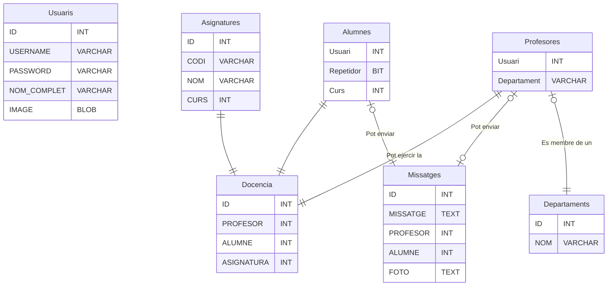
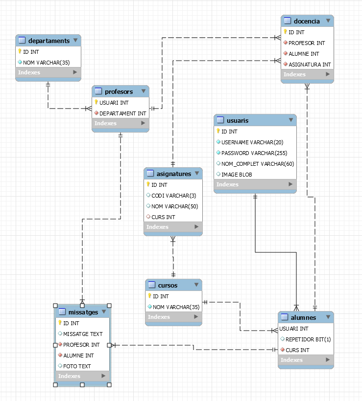

# Readme

## Indice 
- [Readme](#readme)
  - [Indice](#indice)
  - [Requisitos](#requisitos)
  - [Solucion](#solucion)
  - [Esquemas](#esquemas)

## Requisitos 

- Volem fer una aplicació per a la gestió de notes, aplicació que faran servir tant alumnes com a
professors. D’aquests usuaris com a tal, caldra guardar-se el seu nom d’usuari, password, nom
complet i una imatge d’avatar.
- Dels alumnes ens guardarem, ademés, en quin curs està matriculat i si és o no repetidor. Dels
professors ens interessarà emmagatzemar-mos el departament al que pertanyen
- Tenim una sèrie d’assignatures, de les quals es guardarà un codi i nom (nom curt fins a 3 lletres i
nom complet, per exemple PRG-Programació), així com les hores setmanals de docència, mòdul
i curs al que pertanyen.
- Hem de guardar-se la docència, és a dir, quin professor imparteix quina assignatura a quin alumne,
indicant també quina nota ha tret. Tindre en compte que l’únic requeriment és que no poden hi
haure dos profesor distints impartint la mateixa assignatura al mateix alumne.
- També volem implementar un sistema de missatgeria entre alumnes i professors, en el qual ens
guardarem, a banda dels dos participants que tenim, quin era el missatge i una possible imatge
que s’intercanvien. La imatge no la guardarem internament en la BBDD, però si un enllaç al lloc
del sistema on estarà guardada. (a diferència de l’avatar que si es guarda en la BBDD)
- Consideracions:
  - Encara que no aparega, seria adequat afegir un camp ID_nomtaula, autoincremental, per a
no tenir problemes en els identificadors
  - El codi de l’assignatura (PRG, per exemple) no identifica a la mateixa, ja que pot haver dos
assignatures amb el mateix codi ens distints cicles o mòduls (per exemple LMI, que està en
ASIX i DAM)

## Solucion

Crear las tablas Usuaris, Asignaturas, Alumnes, Docencia, Profesores, Departamentos y Mensajes.

## Esquemas

La herramienta que estoy utilizando no me permite representar especializaciones, la tabla ```Usuaris``` tiene como especializaciones las tablas ```Alumnes``` y ```Profesores```.




[Documentacion Mermaid.](https://mermaid-js.github.io/mermaid/#/entityRelationshipDiagram)

Foto tomada de MySQL.
